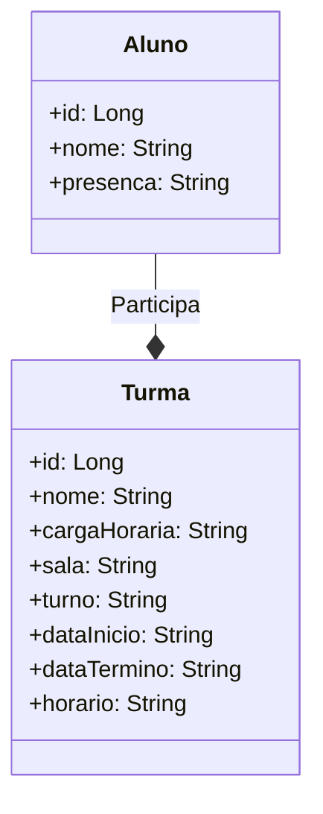

# Chamada-Virtual

### Diagrama de Classe

```mermaid
classDiagram
  class Aluno {
    +id: Long
    +nome: String
    +presenca: String
  }

  class Turma {
    +id: Long
    +nome: String
    +cargaHoraria: String
    +sala: String
    +turno: String
    +dataInicio: String
    +dataTermino: String
    +horario: String
  }

  Aluno --* Turma : Participa
```
